# SmartLegal Maroc

A Flutter mobile application designed to provide legal assistance and document generation services to Moroccan citizens.


## 📄 Project Overview

SmartLegal Maroc helps Moroccan citizens with:
- Answering legal questions through an AI-powered chatbot interface
- Generating common administrative documents through guided form interfaces
- Providing access to legal resources and frequently asked questions

## 👨‍💻 Developer Information
- **Name**: Youssef Ouben Said
- **School**: ENSET Mohammedia
- **Program**: GLSID2 (Génie Logiciel des Systèmes d'Information Distribués)

## 🛠️ Features

### 🔐 Authentication
Secure login and registration system to personalize user experience.

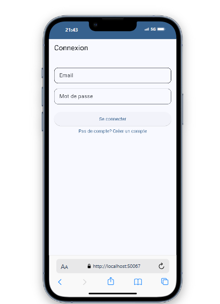
#### validate form


### 🏠 Dashboard
Centralized navigation hub with intuitive access to all app features.

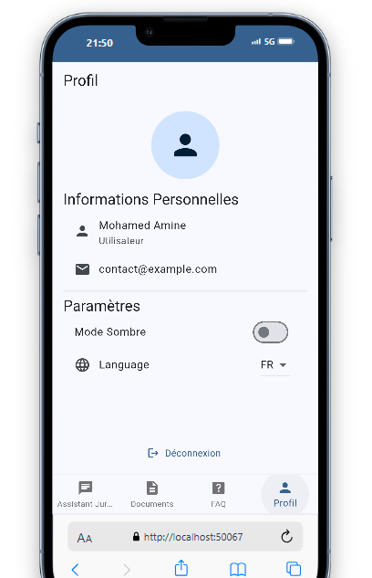
### dark mode

### switch to arabic language


### 🤖 AI Legal Assistant
Interactive chatbot interface for legal consultations.

![Legal assistant chatbot interface showing a conversation in French with grey message bubbles. The assistant says Bonjour, je suis votre assistant juridique. Comment puis-je vous aider aujourd'hui? (Hello, I am your legal assistant. How can I help you today?). The user responds with hello. The assistant then replies with Pour ce type de problème, vous devez contacter le tribunal de première instance de votre ville. Apportez votre CIN et tous les documents relatifs à votre cas (For this type of problem, you must contact the first instance court of your city. Bring your ID card and all documents related to your case). A message input field appears at bottom with text Tapez votre message... (Type your message...) with a microphone icon and navigation buttons below.](images/image3.png)

### 📝 Document Generator
Multi-step forms to generate legal documents customized to user needs.


### 📚 Legal FAQs
Comprehensive database of frequently asked legal questions organized by category.


![FAQ Juridique screen showing expandable legal question sections. Family Law section displays Quelles sont les conditions pour divorcer au Maroc? (What are the conditions for divorce in Morocco?) with partial answer Le divorce au Maroc est régi par le Code de la famille... Another section shows Comment faire une demande de pension alimentaire? (How to request alimony?) with partial answer La demande de pension alimentaire se fait auprès du tribunal... Navigation bar at bottom with Assistant Juridique, Documents, FAQ (highlighted), and Profil options](images/image10.png)

### 👤 User Profile
User profile management with theme and language preferences.


## 🔧 Technical Details

### Architecture
- Clean architecture principles with feature-based organization
- State management using Provider/Riverpod

### Multilingual Support
- Arabic, French, and English language options
- Right-to-left (RTL) layout support for Arabic

### Theming
- Light and dark mode support
- Material 3 design language implementation

## 📱 Screenshots

<table>
  <tr>
    <td></td>
    <td>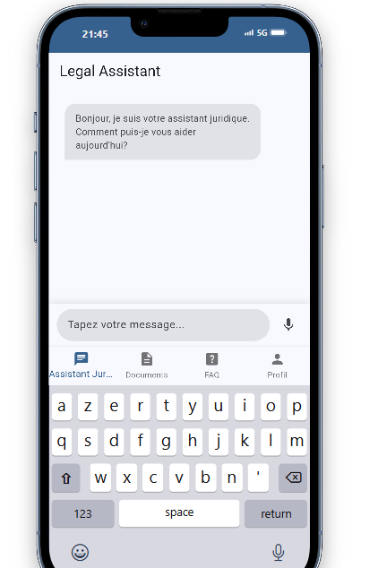</td>
    <td>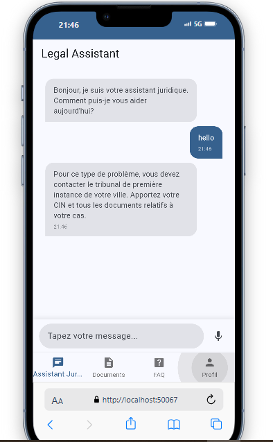</td>
  </tr>
  <tr>
    <td>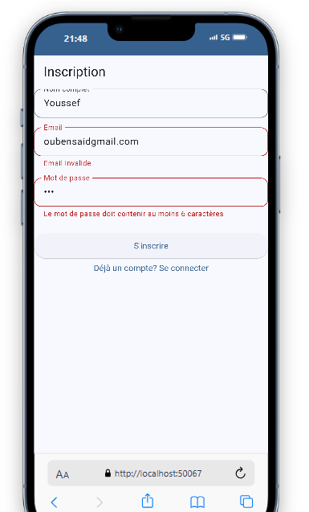</td>
    <td>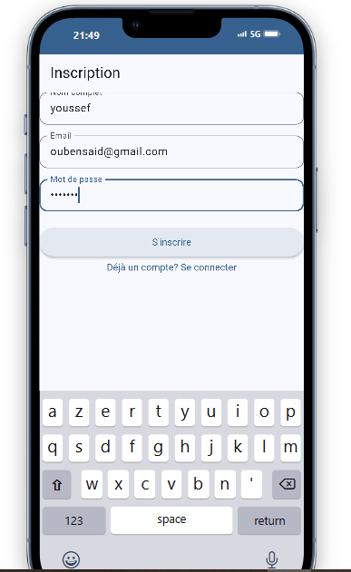</td>
    <td></td>
  </tr>
  <tr>
    <td>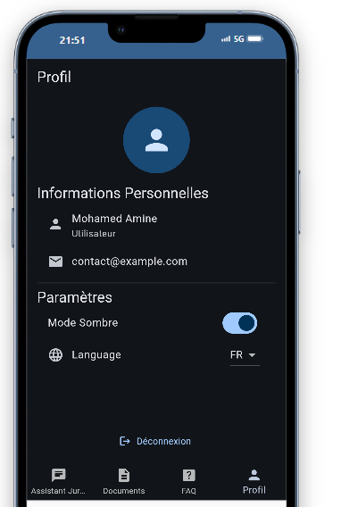</td>
    <td>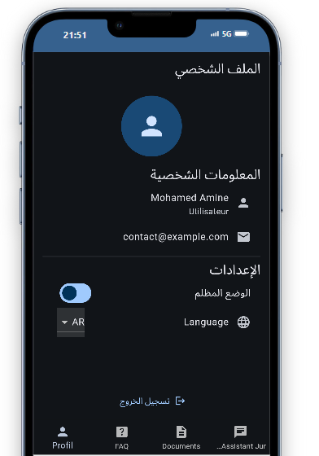</td>
    <td>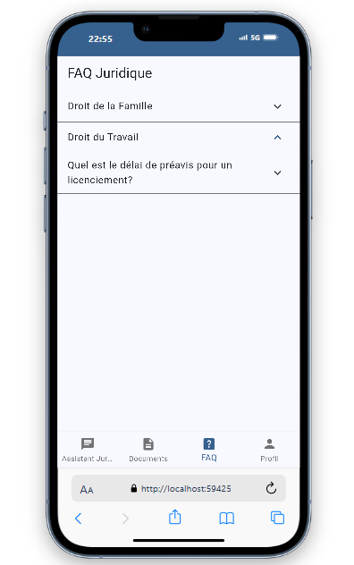</td>
  </tr>
  <tr>
    <td>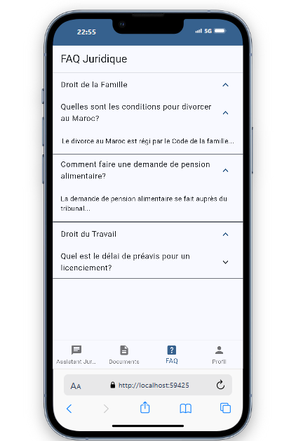</td>
    <td>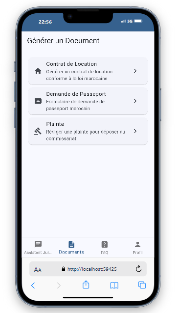</td>
    <td>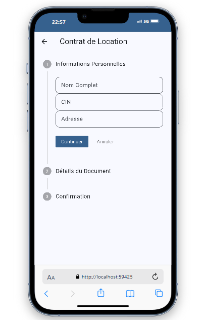</td>
  </tr>
  <tr>
    <td colspan="3" align="center">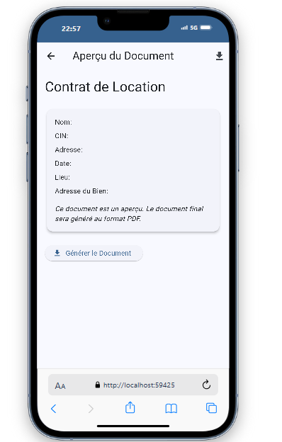</td>
  </tr>
</table>

## 🚀 Getting Started

### Prerequisites
- Flutter 3.19 or higher
- Dart 3.0 or higher

### Installation
1. Clone the repository
```bash
git clone https://github.com/yourusername/smartlegal-maroc.git
```

### Project Structure
```
lib/
├── app/
│   ├── app.dart
│   ├── app_settings_provider.dart  
│   ├── localization.dart
│   └── theme.dart
├── features/
│   ├── auth/
│   ├── chatbot/
│   ├── dashboard/
│   ├── documents/
│   ├── faqs/
│   └── profile/
├── shared/
│   ├── models/
│   ├── services/
│   └── widgets/
└── main.dart
```
